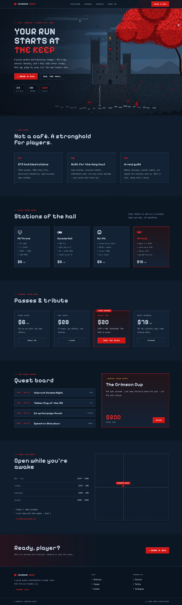
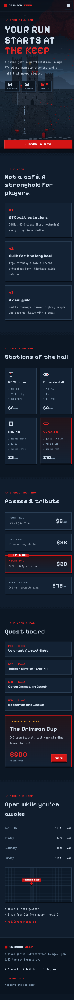

# pixel-gothic — Crimson Keep

A **pixel-art gothic** landing page for a fictional gaming lounge. A lone-hero pixelscape:
masonry-textured castle on a crag, stepped-band slate sky, a huge crimson tree, drifting
petals, birds, a waterfall — and a tiny red-caped wanderer. The page itself is styled as
game-UI: Press Start 2P labels, VT323 body, bezel panels, checker dither dividers.

## Preview

### Desktop (1440)

### Mobile (390)

## Run it

Zero build — open directly in a browser:

- [`desktop.html`](desktop.html) — desktop layout
- [`mobile.html`](mobile.html) — mobile layout

The scene is rendered procedurally at low resolution onto a `<canvas>` and upscaled with
`image-rendering: pixelated` (see [`assets/scene.js`](assets/scene.js)). Petals, birds,
sparkle stars, the lit window, and the hero's cape animate in a light per-frame pass.

## What's reusable

See [`NOTES.md`](NOTES.md) — palette, the masonry/dither recipes, and the game-UI CSS system
(`panel` / `btn` / `dither` / `tag`).
